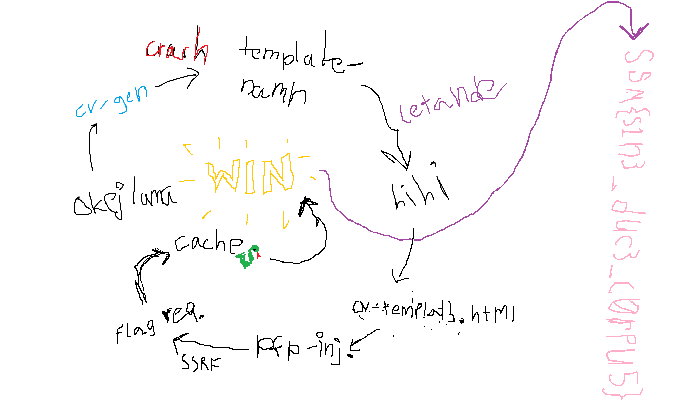

# villedieu le camp - web 500p - Säkerhets-SM final 2023

__Denna writeup är resultatet av ett samarbete mellan CTF-organisationerna Bängla int och DAGYCTF0X2.__

---

## Chall
\> write a two sentence description for a CTF challenge that hints to ------- without mentioning it

Unleash your strategic prowess and uncover the hidden path to victory by exploiting an often overlooked but powerful mechanism that can subtly alter the flow of information, granting you a decisive advantage in this digital battlefield.

\> make it in swedish

Avslöja din strategiska briljans och avslöja den dolda vägen till seger genom att utnyttja en ofta förbisedd men kraftfull mekanism som subtilt kan förändra informationsflödet, vilket ger dig en avgörande fördel på denna digitala slagmark.

Skapare: Movitz Sunar

## Lösning
Vi började med att läsa igenom serverns source code, skriven i Go. Där fann vi tre intressanta funktionaliteter.

Först och främst använder servern Go-modulen html/template. Servern läser in en template-fil från static/cv/*, vi vet alltså inte inte det exakta filnamnet. För vidare analys kommer vi förmodligen vilja hitta det.

```GO
templ := template.Must(template.ParseFS(f, "static/cv/*"))
mux.GET("/api/doc", func(w http.ResponseWriter, r *http.Request, p httprouter.Params) {
    err := templ.Execute(w, r.URL.Query())
    if err != nil {
        w.Write([]byte(err.Error()))
    }
})
```

Efter det skickar servern den bearbetade HTML-filen med en POST-request till endpointen /api/gen-cv, vilken vi antar står för PDF-konverteringen.

```GO
mux.POST("/api/gen-cv", func(w http.ResponseWriter, r *http.Request, p httprouter.Params) {

    b := &bytes.Buffer{}
    wr := multipart.NewWriter(b)
    wr.WriteField("remoteURL", "http://localhost:80/api/doc?"+r.URL.RawQuery)
    wr.Close()

    req, _ := http.NewRequest(http.MethodPost, "http://localhost:3000/convert/url", b)
    req.Header.Add("Content-Type", wr.FormDataContentType())

    resp, err := http.DefaultClient.Do(req)
    if err != nil {
        fmt.Println(err)
        w.Write([]byte(err.Error()))
        return
    }

    io.Copy(w, resp.Body)
})
```

Vårt mål är att anropa endpointen `/flag`, som svarar med flaggan om vi requestar den från localhost. Annars returneras `SSM{nej}`, vilket inte är särskilt hjälpsamt.

```GO
mux.GET("/flag", func(w http.ResponseWriter, r *http.Request, p httprouter.Params) {
    w.Header().Add("Access-Control-Allow-Origin", "http://admin.local")
    if strings.HasPrefix(r.RemoteAddr, "127.0") || strings.HasPrefix(r.RemoteAddr, "[::1]") {
        w.Write([]byte(os.Getenv("flag")))
        return
    }

    w.WriteHeader(http.StatusBadRequest)
    w.Write([]byte("SSM{nej}"))
})
```

Vi vill alltså nå denna med till exempel SSRF.

För att hitta möjliga injektionsvektorer behöver vi nu hitta ett sätt att extrahera det template som används. Ofta kan felmeddelanden läcka filnamnet och därför kan vi försöka nå /api/doc, vilket är den endpoint som hanterar template-bearbetningen. Vid första försöket ges inget eftersom den inte hittas och automatisk redirectar till index.html. Därför undersökte vi de requests som görs då vi genererar en PDF och observerar att endpointsen egentligen nås på `/pdfapi/*`. Requestas `/pdfapi/doc` utan några GET-parametrar orsakas följande felmeddelande:

```
template: cv-templat3.html:12:11: executing "cv-templat3.html" at : error calling index: index of untyped nil
```

Templatet har alltså namnet `cv-templat3.html`, men efter upprepade försök att nå detta via t.ex.
 - /cv-templat3.html
 - /cv/cv-templat3.html
 - /static/cv/cv-templat3.html
 - /pdfapi/cv/cv-templat3.html

på domänen `okejlama.movitz.dev` måste vi titta åt andra håll för att förstå arkitekturen av webappen. Om vi går till den sista av ovanstående endpoints redirectas vi till en annan domän: `hihi.tmpctf.movitz.dev`, på vilken startsidan lyder `frontend is served elsewhere, api only`. Som tidigare känt är hihi även Movitz catch phrase och därmed är vi säkerligen på rätt spår.

När vi nu requestar `/cv/cv-templat3.html` på den nya domänen får vi följande sida:
```html
<!DOCTYPE html>
<html>
<head>
    <meta charset='utf-8'>
    <meta http-equiv='X-UA-Compatible' content='IE=edge'>
    <title>CV {{ .Name }}</title>
    <meta name='viewport' content='width=device-width, initial-scale=1'>
    <link href="https://cdn.jsdelivr.net/npm/bootstrap@5.3.0-alpha3/dist/css/bootstrap.min.css" rel="stylesheet" integrity="sha384-KK94CHFLLe+nY2dmCWGMq91rCGa5gtU4mk92HdvYe+M/SXH301p5ILy+dN9+nJOZ" crossorigin="anonymous">
</head>
<body>

    <h1>{{ index .Name 0 }}</h1> 
    {{ if .ProfilePic }}
        
    {{ end }}

    <h5>Big skills</h5>
    <table class="table">
        <th>
            <td>Skill</td>
            <td>Level</td>
        </th>
        {{ range $v := .Skills }}
            <tr>
                <td>{{ $v }}</td>
                <td>Probably pretty bad</td>
            </tr>
        {{ end }}
    </table>
    
</body>
</html>
```

Jämför vi parametrarna vi hittar på denna med dem vi vanligtvis skickar in via ursprungssidans form: `https://okejlama.movitz.dev/pdfapi/gen-cv?Name=Test&Skills=test`, inser vi att det finns en oanvänd parameter `ProfilePic`. Att modifiera den skulle låta oss ändra source-urlen för en bild vilket ger oss en tydlig SSRF. Vi skickar därför en modifierad POST-request till `/pdfapi/gen-cv` (på den ursprungliga domänen) med en extra `ProfilePic`-parameter som pekar till `/flag`.

```
POST /pdfapi/gen-cv?Name=hihi&Skills=hoho&ProfilePic=/flag HTTP/2
Host: okejlama.movitz.dev
```

Vi får tillbaka en PDF men med en trasig bild som endast indikerar något sorts fel. Det är rimligt, med tanke på att flaggan inte är en bild, men vi kan fortfarande anta att en request gjordes till `/flag`.

Återbesöker vi Go-koden kan vi observera att den konfigurerar caching, samt med stilrena kommentarer uppmärksammar dess vikt.

```GO
    adapter, err := memory.NewAdapter(
        memory.AdapterWithAlgorithm(memory.LRU),
        memory.AdapterWithCapacity(1337),
    )

    // mmm, fazer
    // mmmmm big speed, big cash
    cacheClient, err := cache.NewClient(
        cache.ClientWithAdapter(adapter),
        cache.ClientWithTTL(1*time.Minute),
        cache.ClientWithRefreshKey("opn"),
    )
```

Cachen varar i en minut och gäller för alla endpoints, inkluderande `/flag`. Det innebär att den cacheade endpointen görs tillgänglig efter att PDF-generatorn requestat och lyckats få ut den korrekta flaggan. Inom en minut kan vi därför genom att själva requesta `/flag`, få ut den cacheade och korrekta flaggan.

Flagga: SSM{s1n3_duc3_c0rpu5}

Vi har stor förståelse för att långa tekniska writeups kan vara för mycket att ta in för vissa. Därför har vi illustrerat detta pedagogiska mästerverk.




